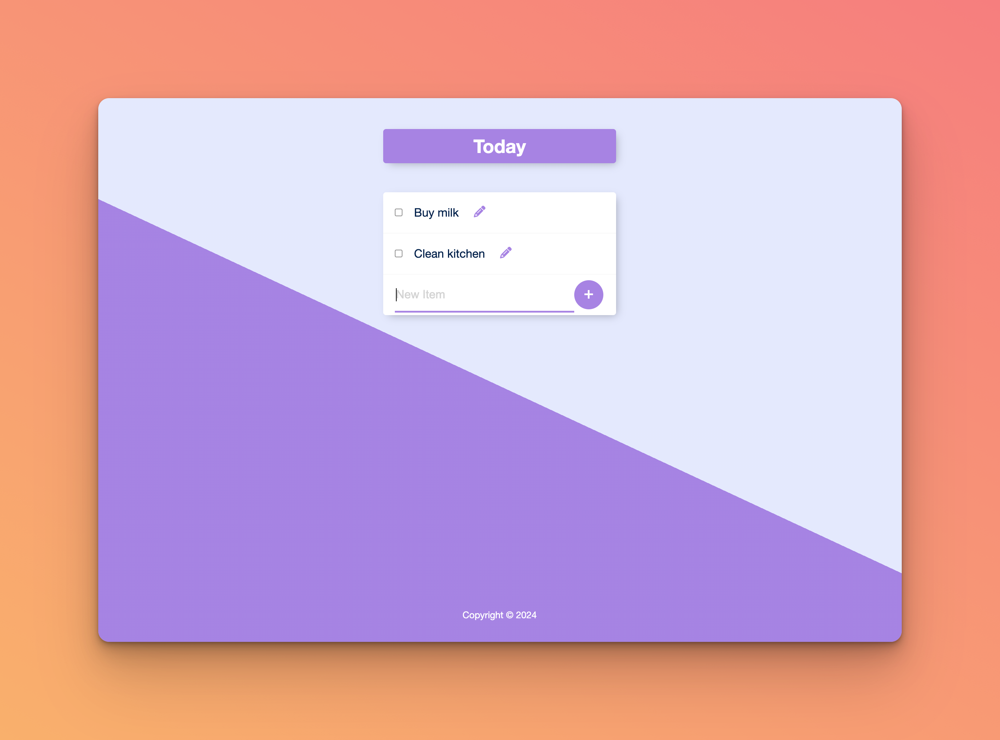

# To-Do List Application

## Description

The To-Do List Application is a simple tool to keep track of daily tasks. It's built using Express.js, with PostgreSQL for data storage. The application allows users to add, edit, and delete tasks, providing a dynamic and interactive experience.



## Key Learnings

- Express.js: Understanding the basics of setting up an Express server and routing.
- PostgreSQL Integration: Utilizing PostgreSQL for storing to-do items.
- CRUD Operations: Implementing Create, Read, Update, and Delete operations on the server-side.
- EJS Templating: Using Embedded JavaScript templating to render dynamic content in HTML.
- Async/Await in JavaScript: Managing asynchronous database operations in Node.js.

## Installation

1. Clone the repository:

```bash
git clone https://github.com/your-username/todo-list-app.git
cd todo-list-app
```

2. Install dependencies:

```bash
npm install
```

3. Ensure PostgreSQL is installed and running. Create a database and table with the provided SQL query.

## Running the Application

1.  Start the server:

```bash
nodemon index.js
```

The server will start on http://localhost:3000.

2. Visit http://localhost:3000 in your browser to use the application.

## Project Structure

- index.js: Main server file containing Express setup and routes.
- views/index.ejs: Main EJS template for the to-do list.
- public/: Directory containing static files like CSS and images.
- partials/: EJS partials for header and footer.

## PostgreSQL Setup

Run the following SQL query to create the necessary table in your PostgreSQL database:

```sql
CREATE TABLE items (
id SERIAL PRIMARY KEY,
title VARCHAR(100) NOT NULL
);
```

## Features

- Add Tasks: Users can add new tasks to their to-do list.
- Edit Tasks: Each task can be edited inline.
- Delete Tasks: Tasks can be deleted from the list.
- Persistent Storage: Tasks are stored in a PostgreSQL database, ensuring data persistence.

## Future Enhancements

- User authentication for personalized to-do lists.
- Date and time support for tasks.
- Improved UI/UX with responsive design.

This project serves as a practical introduction to full-stack development concepts, particularly focusing on server-side operations with Node.js and PostgreSQL.
